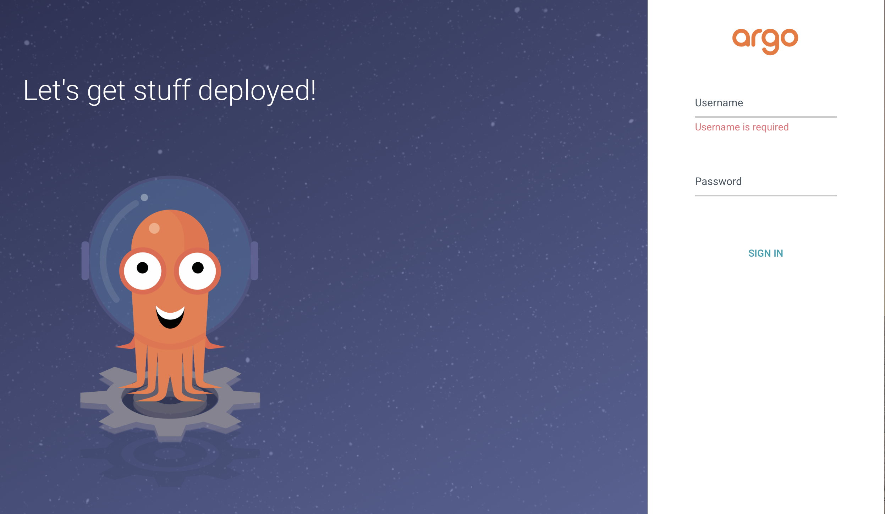
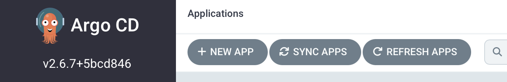
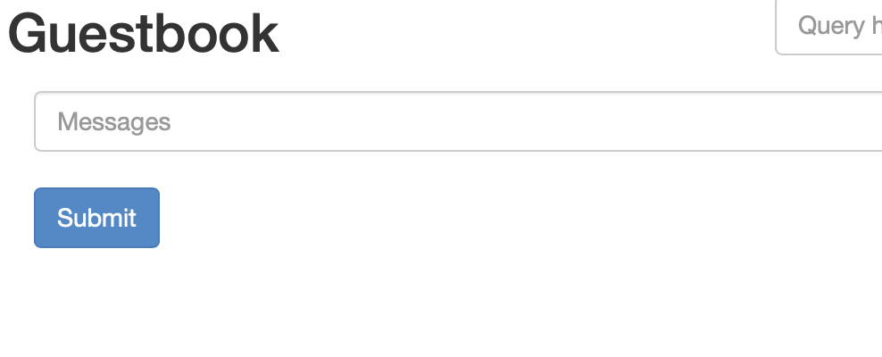

# GitOps with ArgoCD

Argo CD is an open-source GitOps continuous delivery tool. It monitors your cluster and your declaratively-defined infrastructure stored in a Git repository and resolves differences between the two — effectively automating an application deployment.

In this lab you will: 

* Create an all-in-one Kubernetes cluster on the Ubuntu VM
* Install `kubectl`
* Deploy Argo CD
* Configure Argo to monitor a GitLab project

### Install Kubectl

The following steps installed `kubectl` on the Ubuntu server.

Download the `kubectl` binary

```
curl -LO "https://dl.k8s.io/release/$(curl -L -s https://dl.k8s.io/release/stable.txt)/bin/linux/amd64/kubectl"
```

Add execute permissions

```
chmod +x kubectl
```

Move the `kubectl` binary to `/usr/local/bin` so it is in your `$PATH`

```
sudo mv kubectl /usr/local/bin/.
```


### Create a K3d cluster

k3d is a lightweight wrapper to run k3s (Rancher Lab's minimal Kubernetes distribution) in docker. k3d makes it very easy to create single- and multi-node k3s clusters in docker, e.g. for local development on Kubernetes. 

Create a two-node K3d cluster

```
k3d cluster create testcluster --api-port 6443 --servers 1 --agents 1 --port "30500-30600:30500-30600@server:0"
```

This may take a few minutes, but should end with a message similar to: 

```
INFO[0022] Cluster 'testcluster' created successfully!
INFO[0022] You can now use it like this:
```

To confirm you can communicate with the Kubernete's API run: 

```
kubectl get nodes
```

You will see two nodes running 

```
NAME                       STATUS   ROLES                  AGE   VERSION
k3d-testcluster-agent-0    Ready    <none>                 59s   v1.25.7+k3s1
k3d-testcluster-server-0   Ready    control-plane,master   63s   v1.25.7+k3s1
```


### Install Argo CD

GitOps uses Git as a “single source of truth” for CI/CD processes, integrating code changes in a single, shared repository per project and using pull requests to manage infrastructure and deployment.

Argo CD provides Continuous Delivery tooling that automatically synchronizes and deploys your application whenever a change is made in your Git repository. By managing the deployment and lifecycle of an application, it provides solutions for version control, configurations, and application definitions in Kubernetes environments, organizing complex data with an easy-to-understand user interface. It can handle several types of Kubernetes manifests, including Jsonnet, Kustomize, Helm charts, and YAML/json files, and supports webhook notifications from GitHub, GitLab, and Bitbucket.

Create the `argocd` namespace in your cluster, which will contain Argo CD and its associated services:

```bash
kubectl create namespace argocd
```

After that, you can run the Argo CD install script provided by the project maintainers.

```bash
kubectl apply -n argocd -f https://raw.githubusercontent.com/argoproj/argo-cd/stable/manifests/install.yaml
```

Once the installation completes successfully, you can use the `watch` command to check the status of your Kubernetes pods:

```bash
watch kubectl get pods -n argocd
```

By default, there should be five pods that eventually receive the `Running` status as part of a stock Argo CD installation.

```
OutputNAME                                  READY   STATUS    RESTARTS   AGE
argocd-application-controller-0       1/1     Running   0          2m28s
argocd-dex-server-66f865ffb4-chwwg    1/1     Running   0          2m30s
argocd-redis-5b6967fdfc-q4klp         1/1     Running   0          2m30s
argocd-repo-server-656c76778f-vsn7l   1/1     Running   0          2m29s
argocd-server-cd68f46f8-zg7hq         1/1     Running   0          2m28s
```

You can press `Ctrl+C` to exit the `watch` interface. You now have Argo CD running in your Kubernetes cluster! However, because of the way Kubernetes creates abstractions around your network interfaces, you won’t be able to access it directly without forwarding ports from inside your cluster. You’ll learn how to handle that in the next step.

### Expose the Argo CD service

The `argocd-server` service is configured as a `clusterIP` type by default. This means the only way to access it is to use `kubectl port-forward`. However because we are connecting to a remote machine, we are going to expose the service. 

Change the service type to `NodePort`

```
kubectl patch svc argocd-server -n argocd -p '{"spec": {"type": "NodePort"}}'  
```

Now we need to open the service configuration and change the ports. 

```
kubectl edit svc -n argocd argocd-server
```

Under the **ports** section, change the following: 

* the **http** `nodePort` to `30501`
* The **https** `nodePort` to `30502`

So it looks like this

```yaml
- name: http
    nodePort: 30501
    port: 80
    protocol: TCP
    targetPort: 8080
  - name: https
    nodePort: 30502
    port: 443
    protocol: TCP
    targetPort: 8080
```

Save the file and exit the editor. 

Confirm you can access the Argo webUI in a browser by visting `https://<IP_from_spreadsheet>:30502`

Accept the warning and you should see something like this: 



## Working with Argo CD from the Command Line

For the next steps, you’ll want to have the `argocd` command installed locally for interfacing with and changing settings in your Argo CD instance.

```bash
curl -sSL -o argocd-linux-amd64 https://github.com/argoproj/argo-cd/releases/latest/download/argocd-linux-amd64
sudo install -m 555 argocd-linux-amd64 /usr/local/bin/argocd
rm argocd-linux-amd64
```

This in turn provides the `argocd` command. Before using it, you’ll want to use `kubectl` again to retrieve the admin password which was automatically generated during your installation, so that you can use it to log in. You’ll pass it a path to a particular JSON file that’s stored using Kubernetes secrets, and extract the relevant value:

```bash
kubectl -n argocd get secret argocd-initial-admin-secret -o jsonpath="{.data.password}" | base64 -d; echo
```

You can then log into your Argo CD dashboard by going back to `https://<IP FROM SPREADSHEET>:30502` in a browser and logging in as the `admin` user with your own password:



Once everything is working, you can use the same credentials to log in to Argo CD via the command line, by running `argocd login`. This will be necessary for deploying from the command line later on:

```bash
argocd login `curl -s ifconfig.me`:30502
```

You’ll receive the equivalent certificate warning again on the command line here, and should enter `y` to proceed when prompted. If desired, you can then change your password to something more secure or more memorable by running `argocd account update-password`. After that, you’ll have a fully working Argo CD configuration. In the final steps of this tutorial, you’ll learn how to use it to actually deploy some example applications.

## Handling Multiple Clusters (Optional)

Because we only have one cluster, the following is not application. It is good information for future deployments though.

Before deploying an application, you should review where you actually want to deploy it. By default, Argo CD will deploy applications to the same cluster that Argo CD itself is running in, which is fine for a demo, but is probably not what you’ll want in production. In order to list all of the clusters known to your current machine, you can use `kubectl config`:

```bash
kubectl config get-contexts -o name
test-deploy-cluster
test-target-cluster
```

Assuming that you’ve installed Argo CD into `test-deploy-cluster`, and you wanted to use it to deploy applications onto `test-target-cluster`, you could register `test-target-cluster` with Argo CD by running `argocd cluster add`:

```bash
argocd cluster add target-k8s
```

This will add the additional cluster’s login details to Argo CD, and enable Argo CD to deploy services on the cluster.

## Deploying an Example Application (Optional)

Now that you have Argo CD running and you have an understanding of how to deploy applications to different Kubernetes clusters, it’s time to put it into practice. Use this repository of example applications that have been architected to showcase GitOps fundamentals. Many of these examples are ports of the same `guestbook` demo app to different kinds of Kubernetes manifests, such as [Jsonnet](https://jsonnet.org/). In this case, you’ll be deploying the `helm-guestbook`example, which uses a [Helm chart](https://github.com/argoproj/argocd-example-apps/blob/master/helm-guestbook/Chart.yaml), one of the most durable Kubernetes management solutions.

In order to do that, you’ll use the `argocd app create` command, providing the path to the GitLab repository, the specific `helm-guestbook` example, and passing your default destination and namespace:

```bash
argocd app create helm-guestbook --repo https://gitlab.com/jruels/argo-example-apps.git --path helm-guestbook --dest-server https://kubernetes.default.svc --dest-namespace default
```

After “creating” the application inside of Argo CD, you can check its status with `argocd app get`:

```bash
argocd app get helm-guestbook
Output
Name:               helm-guestbook
Project:            default
Server:             https://kubernetes.default.svc
Namespace:          default
URL:                https://localhost:8080/applications/helm-guestbook
Repo:               https://github.com/argoproj/argocd-example-apps.git
Target:
Path:               helm-guestbook
SyncWindow:         Sync Allowed
Sync Policy:        <none>
Sync Status:        OutOfSync from  (53e28ff)
Health Status:      Missing

GROUP  KIND        NAMESPACE  NAME            STATUS     HEALTH   HOOK  MESSAGE
       Service     default    helm-guestbook  OutOfSync  Missing
apps   Deployment  default    helm-guestbook  OutOfSync  Missing
```

The `OutOfSync` application status is normal. You’ve retrieved the application’s helm chart from Github and created an entry for it in Argo CD, but you haven’t actually spun up any Kubernetes resources for it yet. In order to actually deploy the application you’ll run `argocd app sync`:

```bash
argocd app sync helm-guestbook
```

`sync` is synonymous with deployment here in keeping with the principles of GitOps – the goal when using Argo CD is for your application to always track 1:1 with its upstream configuration.

```
Output
TIMESTAMP                  GROUP        KIND   NAMESPACE                  NAME    STATUS    HEALTH        HOOK  MESSAGE
2023-04-20T06:28:06+00:00            Service     default        helm-guestbook  OutOfSync  Missing
2023-04-20T06:28:06+00:00   apps  Deployment     default        helm-guestbook  OutOfSync  Missing
2023-04-20T06:28:07+00:00            Service     default        helm-guestbook    Synced  Healthy
2023-04-20T06:28:07+00:00            Service     default        helm-guestbook    Synced   Healthy              service/helm-guestbook created
2023-04-20T06:28:07+00:00   apps  Deployment     default        helm-guestbook  OutOfSync  Missing              deployment.apps/helm-guestbook created
2023-04-20T06:28:07+00:00   apps  Deployment     default        helm-guestbook    Synced  Progressing              deployment.apps/helm-guestbook created

Name:               argocd/helm-guestbook
Project:            default
Server:             https://kubernetes.default.svc
Namespace:          default
URL:                https://18.144.73.137:30502/applications/helm-guestbook
Repo:               https://gitlab.com/jruels/argo-example-apps.git
Target:
Path:               helm-guestbook
SyncWindow:         Sync Allowed
Sync Policy:        <none>
Sync Status:        Synced to  (53e28ff)
Health Status:      Progressing

Operation:          Sync
Sync Revision:      53e28ff20cc530b9ada2173fbbd64d48338583ba
Phase:              Succeeded
Start:              2023-04-20 06:28:06 +0000 UTC
Finished:           2023-04-20 06:28:07 +0000 UTC
Duration:           1s
Message:            successfully synced (all tasks run)

GROUP  KIND        NAMESPACE  NAME            STATUS  HEALTH       HOOK  MESSAGE
       Service     default    helm-guestbook  Synced  Healthy            service/helm-guestbook created
apps   Deployment  default    helm-guestbook  Synced  Progressing        deployment.apps/helm-guestbook created
```

You have now successfully deployed an application using Argo CD! It is possible to accomplish the same thing from the Argo CD web interface, but it is usually quicker and more reproducible to deploy via the command line. However, it is very helpful to check on your Argo CD web dashboard after deployment in order to verify that your applications are running properly. You can see that by opening `https://<IP FROM SPREADSHEET>:30502` in a browser:


At this point, the last thing to do is to ensure you can access your new deployment in a browser. 

Just like before, the `helm-guestbook` service is configured as a `clusterIP` type by default. This means the only way to access it is to expose the service. 

Change the service type to `NodePort`

```
kubectl patch svc helm-guestbook -p '{"spec": {"type": "NodePort"}}'  
```

Now we need to open the service configuration and change the ports. 

```
kubectl edit svc helm-guestbook
```

Under the **ports** section, change the following: 

* the **http** `nodePort` to `30503`

So it looks like this

```yaml
ports:
  - name: http
    nodePort: 30503
```

Save the file and exit the editor. 

You can then open `http://<IP FROM SPREADSHEET>:30503` in a browser window to see your example guestbook app:



Any further pushes to this GitLab repository will automatically be reflected in ArgoCD, which will resync your deployment while providing continuous availability.
