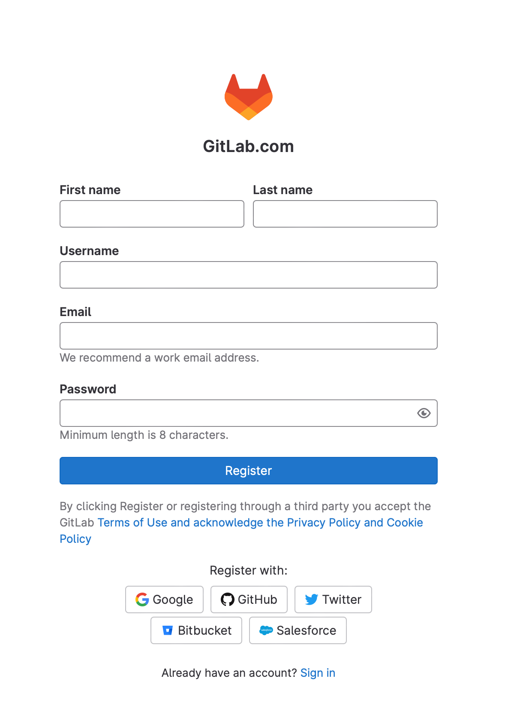

# GitLab with Git Basics

## WHAT IS THE DIFFERENCE BETWEEN GIT AND GITLAB?

Git is a version control system that locally checks changes in a project or folder. Once we add Git to our project, it will start tracking for changes and also push and pull changes from remote repositories like GitHub, BitBucket, and GitLab.

GitLab provides a service that allows you to host a project or folder on a remote repository and has additional features to help in the software delivery life cycle and CICD. 

Some features include:

- Managing code
- Code sharing
- Wiki or code documentation
- Bug tracking
- CICD
- Auto DevOps


### Create a free GitLab account

[Sign up](https://gitlab.com/users/sign_up) for an account or log in with your existing GitHub, Google, or other available accounts.



Complete the following objectives using all resources available. After the allotted lab time, the instructor will walk through the solution to the lab.

* In GitLab complete the following

  * Create a new blank project with with the following attributes
    * **Project Name** = `Top Level Project`
    * Private repository
    * Initialize with a README
  * Create an issue
    * **Title** = `my first issue`
    * Assign the issue to yourself
  * Create custom labels (you select the background colors)
    * `Opened`
    * `Needs documentation`
    * `Completed`
  * Add a comment to the issue
    * Use the quick action `/spend 1 hour`
    * You'll notice it updates the time-tracking widget.
  * Assign labels to the issue
    * Assign the `Opened` and `Needs documentation` labels

* In AWS CloudShell

  * Create a working directory
    * `$HOME/gitlab`
  * Generate an SSH key

* In GitLab add the SSH public key

  * In the GitLab UI, click your avatar on the top right side. Click **Edit profile**, and select **SSH Keys** on the left. 
  * Add a new SSH key, by pasting the contents of `$HOME/.ssh/id_rsa.pub` into the **Key** field

* In AWS CloudShell

  * Run the following command to confirm your SSH key is set up correctly.

    ```
    ssh -T git@gitlab.com
    ```

  * Clone the repository to the working directory
    * Enter the repository directory you just cloned. Git will track all files in this directory; any `git` commands you run in this lab should be run from this directory.
    * Notice there is a `.git` directory, which turns it into a Git repository
  * Create a new branch
    * Name = `temporary_branch`
    * Check out the branch
  * Edit the `README.md` file and add the following to the bottom
    * This line was added to temporary_branch using `git`
  * Commit the file and push it
  * Add another line, commit, and push
    * `a second line in README.md`


### Edit a remote branch

Let’s simulate someone else in your organization making a change to the **temporary_branch** that lives in the remote repository on the GitLab instance. When we finish this section, the remote and local versions of **temporary_branch** will be different: the code on that branch will have moved under your feet (so to speak). We’ll see how to reconcile this difference in the section after this one.

1. In GitLab, navigate to the **Top Level Project** landing page. If you’re not already on **temporary_branch**, go to the left-hand navigation pane and select **Repository > Branches > temporary_branch**.

2. You are now looking at files in **temporary_branch**. Select **README.md** to see its contents.

3. Select **Web IDE** to edit the file.

4. In the Web IDE screen, add a new line to the end of the file.

   ```
   a third line was added using the Web IDE 
   ```

5. On the left, click the Source Control button 

6. Add a commit message and click **Commit & Push**

7. A new window pops up; select **No Use the current branch...**

8. Normally every branch you commit to needs an associated merge request, but you don't need one for this lab. 

9. The changes are now finalized on the remote repository’s **temporary_branch**. Since you made this change in GitLab web UI, the remote repository on the GitLab instance is now one commit *ahead* of your local repository.

### Get metadata about changes to the remote **temporary_branch**

Your local **temporary_branch** is out of sync with the remote **temporary_branch** on the GitLab instance. 

Use `git fetch` and `git status` to compare them.

### Merge changes

Pull and merge the changes into the `main` branch

### Update the remote repository

Push the changes to the remote repository